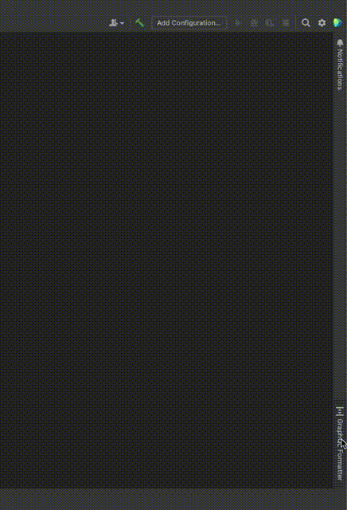
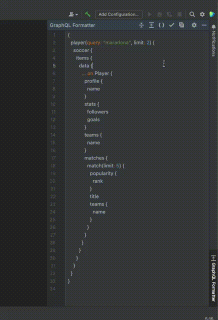

# graphql-formatter

## Template ToDo list

- [ ] Set the `PLUGIN_ID` in the above README badges.
- [ ] Set
  the [Plugin Signing](https://plugins.jetbrains.com/docs/intellij/plugin-signing.html?from=IJPluginTemplate)
  related [secrets](https://github.com/JetBrains/intellij-platform-plugin-template#environment-variables).
- [ ] Set
  the [Deployment Token](https://plugins.jetbrains.com/docs/marketplace/plugin-upload.html?from=IJPluginTemplate).

<!-- Plugin description -->
An IntelliJ plugin to format, maximize and minimize GraphQL queries and schemas.

The plugin can format both GraphQL queries and GraphQL schemas. Open the plugin tool window and
paste the text that you want to format.

The following operations can be performed:

* **Collapse** text to a minimized format without comments, documentation or whitespace.
* **Expand** text to a structured format preserving comments and documentation.
* **Compress GraphQL queries** to a format where leaves of the query types are placed on the same line
  and all end braces are placed on the same line. This is useful when you want to use queries in
  tests; to have an overview of the query, but preserve the number of lines used. Compressing a
  GraphQL schema will just expand it.
* **Verify** GraphQL to check if the query or schema is syntactically valid.

<!-- Plugin description end -->

### Screenshots

## Installation

- Using IDE built-in plugin system:

  <kbd>Settings/Preferences</kbd> > <kbd>Plugins</kbd> > <kbd>Marketplace</kbd> > <kbd>Search for "
  graphql-formatter"</kbd> >
  <kbd>Install Plugin</kbd>

- Manually:

  Download the [latest release](https://github.com/Ekryd/graphql-formatter/releases/latest) and
  install it manually using
  <kbd>Settings/Preferences</kbd> > <kbd>Plugins</kbd> > <kbd>⚙️</kbd> > <kbd>Install plugin from
  disk...</kbd>

---
Plugin based on the [IntelliJ Platform Plugin Template][template].

[template]: https://github.com/JetBrains/intellij-platform-plugin-template

[docs:plugin-description]: https://plugins.jetbrains.com/docs/intellij/plugin-user-experience.html#plugin-description-and-presentation

# Acknowledgement

A big 'Thank you' to Jiaxing Zhang for the inspiring [JSON Formatter plugin](https://plugins.jetbrains.com/plugin/13931-json-formatter).

Thanks to IntelliJ for the thorough documentation around building plugins.  
